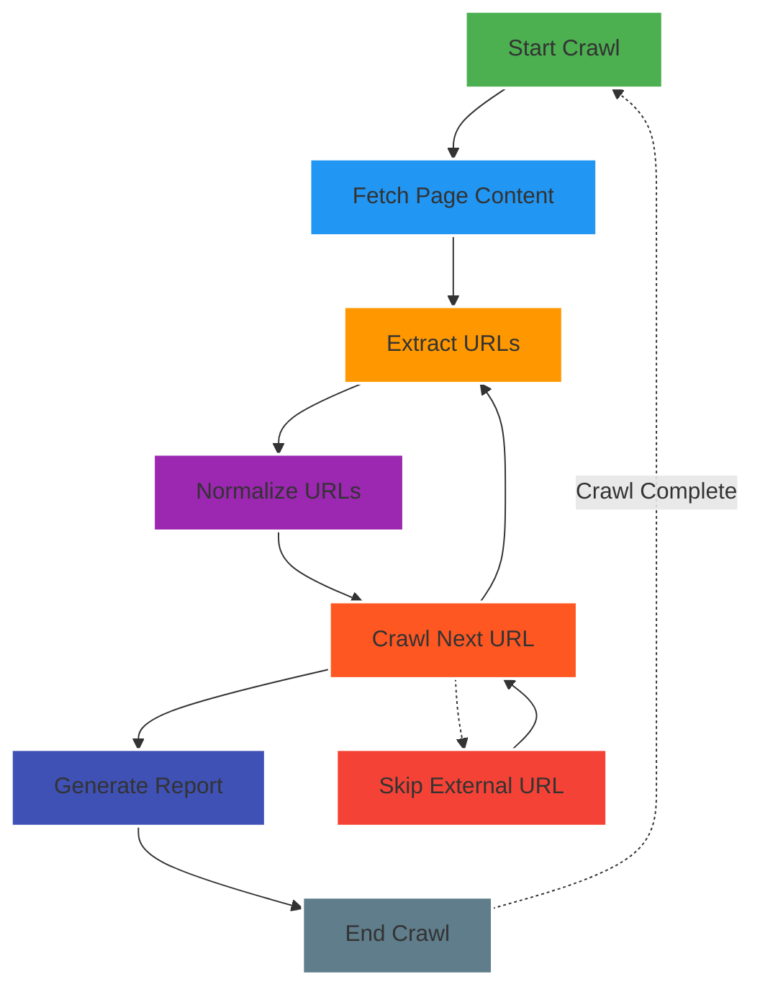

# LinkLynx

**LinkLynx** is a web crawler designed to analyze and map the connectivity between web pages. It systematically crawls through a website, collects URLs, and creates a report of the links discovered across the site. The main goal of LinkLynx is to visualize how pages on a website are interlinked, which can be useful for SEO, data analysis, and website optimization.

---

## Features

- **Crawl Web Pages**: Fetches and follows links within a domain.
- **URL Normalization**: Removes inconsistencies such as protocols, trailing slashes, and capitalization from URLs.
- **Link Extraction**: Identifies and processes both relative and absolute links from HTML.
- **Report Generation**: Outputs a sorted report of the pages and their link frequencies.

---

## Table of Contents

- [Installation](#installation)
- [Usage](#usage)
- [How it Works](#how-it-works)
- [Code Structure](#code-structure)
- [Testing](#testing)
- [License](#license)

---

## Installation

LinkLynx requires **Node.js** and **npm** to be installed on your system.

1. Clone the repository:
   ```bash
   git clone https://github.com/sailwalpranjal/LinkLynx.git
   cd LinkLynx
   ```

2. Install dependencies:
   ```bash
   npm install
   ```

3. You're ready to crawl!

---

## Usage

To use LinkLynx, simply run the following command in your terminal:
```bash
npm run start <website-url>
```

> **Note:** Replace `<website-url>` with the URL of the website you wish to crawl.

This command will initiate the crawling process on the specified website.
### Example:

```bash
npm run start https://example.com
```

This will start the crawl process and generate a report of the links found on the website.

---

## How it Works

### 1. **Crawl Web Pages**  
The crawler begins by fetching the initial page provided in the command line argument. It processes the page and extracts all internal links. Then, it recursively crawls through those links to gather more pages.

### 2. **URL Normalization**  
URLs are normalized to ensure consistency. This includes removing protocols (http/https), handling relative paths, and eliminating any unnecessary trailing slashes.

### 3. **Link Extraction**  
Using the **jsdom** library, the HTML of each page is parsed to identify all anchor (`<a>`) tags and their respective `href` attributes. These links are categorized as either **absolute** or **relative**.

### 4. **Generating the Report**  
Once all pages are crawled, the `printReport` function generates a list of URLs and the frequency of how often each page was linked to. This list is sorted in descending order based on the link count.

---

## Code Structure
```
LinkLynx/
├── crawl.js           # Main crawling logic (normalization, URL extraction)
├── crawl.test.js      # Tests for crawl.js functionality
├── report.js          # Report generation and sorting logic
├── report.test.js     # Tests for report.js functionality
├── main.js            # Entry point for crawling and report generation
├── package.json       # Project dependencies and scripts
└── README.md          # Documentation for the project
```

### Core Functions:

#### `normalizeURL(urlString)`
Normalizes a URL by removing the protocol and trailing slashes.

#### `getURLsFromHTML(htmlBody, baseURL)`
Extracts URLs from the HTML body, converting relative URLs to absolute ones using the base URL.

#### `crawlPage(baseURL, currentURL, pages)`
Recursively crawls a webpage and its links. Returns an object with the URLs and their respective counts.

#### `printReport(pages)`
Generates a human-readable report of the pages with their link frequency.

#### `sortPages(pages)`
Sorts the crawled pages based on the number of times they are linked.

---

## Flowchart

flowchart of how the LinkLynx crawler works:



---

## Testing

LinkLynx uses **Jest** for unit testing, ensuring the core functions work correctly.

### Unit Tests:

- **normalizeURL**: Validates URL normalization, such as stripping protocols and handling trailing slashes.
- **getURLsFromHTML**: Verifies that both absolute and relative links are correctly extracted from HTML.
- **sortPages**: Ensures the correct sorting of pages based on their link count.

```bash
npm run test
```

---

## License

MIT License – See `LICENSE` for more details.

---

## Contributing

 If you'd like to improve LinkLynx, feel free to submit a pull request or open an issue for discussion.

---
